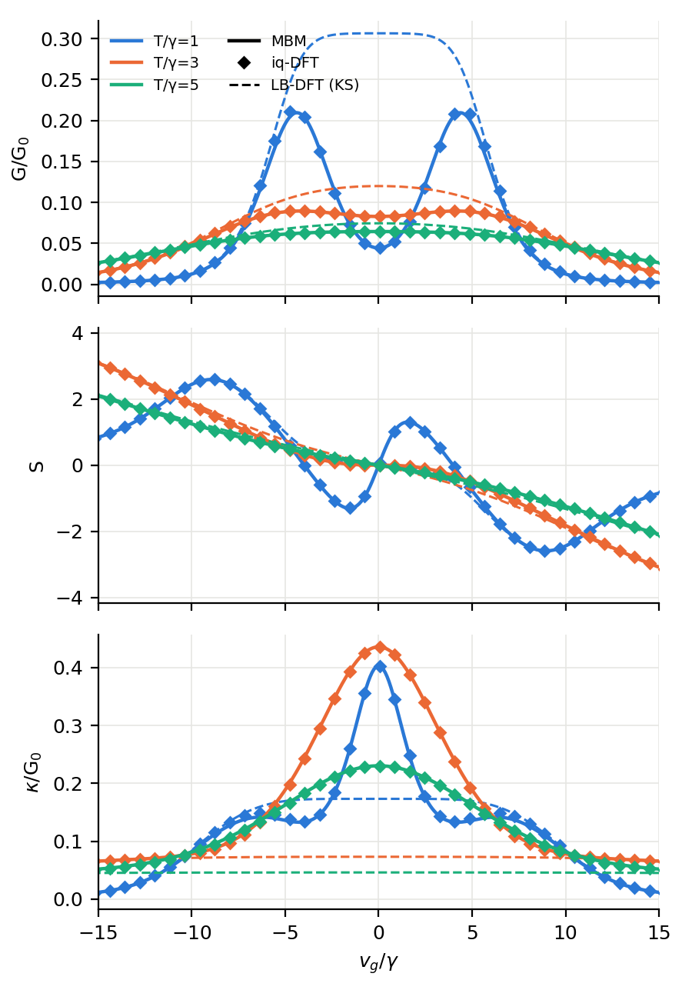

# iq-DFT: thermoelectric transport within density functional theory

Code and data for

> N. Sobrino, F. Eich, G. Stefanucci, R. D'Agosta and S. Kurth,
> *Thermoelectric transport within density functional theory*,
> [Phys. Rev. B **104**, 125115 (2021)](https://doi.org/10.1103/PhysRevB.104.125115),
> [arXiv:2107.01940](https://arxiv.org/abs/2107.01940).

iq-DFT is a steady-state DFT for two-terminal junctions. It establishes a
one-to-one map between the "densities" (n, I, Q) (density, charge current,
heat current) and the "potentials" (v, V, Psi) (gate, bias, normalized
thermal gradient Psi = (T_L - T_R)/T). The Kohn-Sham (KS) system therefore
carries three xc potentials: v_Hxc, V_xc and Psi_xc. In linear response the
exact transport coefficients follow from the KS ones and the xc kernel

```
F_xc = [[dV_xc/dI, dV_xc/dQ], [dPsi_xc/dI, dPsi_xc/dQ]] = L_s^-1 - L^-1
```

where L and L_s are the interacting and KS Onsager matrices. This repository
implements the application to the single impurity Anderson model (SIAM) in
the Coulomb-blockade regime, Sec. IV of the paper:

* closed-form digamma/trigamma expressions for densities, currents and Onsager
  matrices of the KS system and of the many-body model (MBM), Eqs. (25)-(29)
  and (A17);
* analytic reverse-engineered xc derivatives from the single-site model
  (SSM), Eqs. (30)-(32), and their exact numerical counterparts;
* the self-consistent iq-DFT linear-response calculation, Eq. (21);
* scripts that regenerate Figs. 1-5, and tests that check them against the
  original data of the published figures.



## Installation

Requires Python >= 3.8 with numpy and scipy (matplotlib for the figures).

```bash
git clone https://github.com/Nahualcsc/iq-DFT.git
cd iq-DFT
pip install -e ".[plot,test]"
```

## Usage

```python
import numpy as np
from iqdft import dft

gamma, U, T = 1.0, 8.0, 1.0
vg = np.linspace(-15, 15, 301)                 # gate voltage v_g = v + U/2
res = dft.linear_response(vg - U / 2, T, gamma, U)   # scheme="exact-ks" (default)
mbm = dft.mbm_linear_response(vg - U / 2, T, gamma, U)

res["G"], res["S"], res["kappa"]     # iq-DFT (G, kappa in atomic units; G0 = 1/pi)
res["Gs"], res["Ss"], res["kappas"]  # KS = LB-DFT
res["dVxc_dI"], res["dVxc_dQ"], res["dPsixc_dQ"]
```

Lower-level building blocks:

| module | content |
|---|---|
| `iqdft.siam` | `ks_densities`, `mbm_densities` (n, I, W, Q at finite V, Psi); `M_matrix`, `L_ks`, `L_mbm`; `transport_coefficients` |
| `iqdft.ssm` | SSM gate-density relations `vs_of_n`, `v_of_n` and `v_hxc` |
| `iqdft.xc` | `xc_kernel`, `dyson`, `xc_derivatives_ssm` (analytic), `xc_derivatives_exact` (numerical inversion) |
| `iqdft.dft` | `linear_response` (schemes `"exact-ks"`, `"paper"`, `"ssm"`), `solve_density`, `mbm_linear_response` |
| `iqdft.paper` | parameters and data tables of Figs. 1-5 |
| `iqdft.special` | complex trigamma function |

## Reproducing the paper

```bash
python scripts/make_figures.py                     # Figs. 1-5 as published -> results/
python scripts/make_figures.py --scheme exact-ks   # Figs. 2-5 with another scheme (see below)
python scripts/make_figures.py --compare-schemes   # + results/figures/scheme_comparison.png
pytest                                             # 40 tests, a few seconds
```

`tests/test_published_data.py` recomputes every data file behind the published
figures (`published_data/`, all columns) and requires agreement to 1e-6.
In practice the agreement is at the 1e-9 level or better.
`tests/test_analytics.py` checks the closed-form expressions against direct
numerical integration, finite differences and mpmath.

## Computational schemes

The SIAM calculations combine the KS system of the dot coupled to the leads
(KS-SIAM, coupling gamma) with approximations taken from the single-site
model (SSM). `dft.linear_response` offers three ways of doing this, selected
with `scheme=`:

| scheme | Hxc potential | xc kernel | use |
|---|---|---|---|
| `"exact-ks"` (default) | v_s^KS(n) - v^SSM(n) | R_s(v_s^KS(n)) - R(v^SSM(n), n) | finite-coupling KS-SIAM, non-interacting part exact |
| `"paper"` | Eq. (32), density from the uncoupled KS site | Eqs. (30)-(31) | the setting used for the figures of the paper |
| `"ssm"` | Eq. (32) in the KS-SIAM | Eqs. (30)-(31) | SSM expressions inserted directly |

Here v_s^KS(n) is the numerical inverse of the KS-SIAM density, and
R = L^-1 is the resistance matrix.

In `"exact-ks"` only the interacting gate v^SSM(n) is approximated; everything
non-interacting is treated exactly. The self-consistency condition reduces to
v^SSM(n) = v, so the density is the SSM density n_SSM(v). The Dyson equation
then gives L = L_MBM(v, n_SSM(v)): the iq-DFT transport coefficients are those
of the many-body model evaluated at the SSM density.

`"exact-ks"` and `"paper"` give identical densities and iq-DFT coefficients
(checked in `tests/test_analytics.py`). They differ only in the KS potential,
and hence in the KS (LB-DFT) coefficients. `"paper"` reproduces all columns of
the published data files, including the LB-DFT curves of Fig. 3.

`"ssm"` gives densities closer to the many-body model at low temperature, and
somewhat less accurate transport coefficients.
`python scripts/make_figures.py --compare-schemes` plots the three schemes
side by side (`results/figures/scheme_comparison.png`).

## Implementation notes

* Energy current of the KS level at finite bias and thermal gradient
  (Eqs. (27), (A16)), with z_{L/R} as in Eq. (27):

  ```
  W = gamma^2/(4 pi) [Re psi(z_L) - Re psi(z_R) + log((1 + Psi/2)/(1 - Psi/2))] + v_s I,
  Q = W - (V/2) I
  ```

  `tests/test_analytics.py` checks n, I, W and Q against direct numerical
  integration.
* The complex trigamma function (`iqdft.special`) uses the recurrence
  relation followed by the asymptotic series. It is checked against mpmath.
* The code covers the linear-response regime of the paper. Densities and
  currents at finite bias and thermal gradient (`siam.ks_densities`,
  `siam.mbm_densities`) are included as building blocks for functionals
  beyond linear response.

## Repository layout

```
iqdft/            Python package
scripts/          make_figures.py
tests/            analytic checks + regression against the published data
published_data/   data files and xmgrace projects of the published figures, final eps
results/figures/  figures regenerated by scripts/make_figures.py
```

## Citation and license

If you use this code, please cite the paper above (see `CITATION.cff`).
Released under the MIT license (`LICENSE`).
